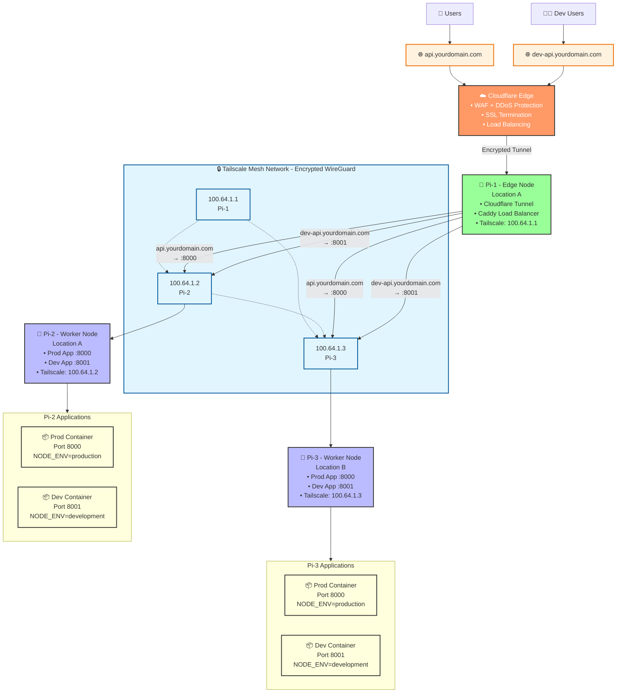

# Archietcture diagram

Network: Internet → Cloudflare → Pi-1 (LB Only) → Tailscale Mesh → Pi-2 & Pi-3 (Mixed)

Pi-1:

- Cloudflare tunnel
- Caddy Load Balancer (Routes traffic)

Pi-2 thru N:

- Run applications

