# Archietcture diagram

Network: Internet → Cloudflare → Pi-1 (LB Only) → Tailscale Mesh → Pi-2 & Pi-3 (Mixed)

Pi-1:

- Cloudflare tunnel
- Caddy Load Balancer (Routes traffic)

Pi-2 thru N:

- Run applications

```mermaid
graph TB
    %% External traffic
    Users[👥 Users]
    DevUsers[👨‍💻 Dev Users]

    %% Cloudflare layer
    CF[☁️ Cloudflare Edge<br/>• WAF + DDoS Protection<br/>• SSL Termination<br/>• Load Balancing]

    %% DNS routing
    ProdDNS[🌐 api.yourdomain.com]
    DevDNS[🌐 dev-api.yourdomain.com]

    %% Pi-1 (Edge + Load Balancer)
    Pi1[🔧 Pi-1 - Edge Node<br/>Location A<br/>• Cloudflare Tunnel<br/>• Caddy Load Balancer<br/>• Tailscale: 100.64.1.1]

    %% Tailscale mesh network
    subgraph Tailnet[🔒 Tailscale Mesh Network - Encrypted WireGuard]
        direction TB
        TailscaleNode1[100.64.1.1<br/>Pi-1]
        TailscaleNode2[100.64.1.2<br/>Pi-2]
        TailscaleNode3[100.64.1.3<br/>Pi-3]

        TailscaleNode1 -.-> TailscaleNode2
        TailscaleNode1 -.-> TailscaleNode3
        TailscaleNode2 -.-> TailscaleNode3
    end

    %% Pi-2 (Worker)
    Pi2[💼 Pi-2 - Worker Node<br/>Location A<br/>• Prod App :8000<br/>• Dev App :8001<br/>• Tailscale: 100.64.1.2]

    %% Pi-3 (Worker)
    Pi3[💼 Pi-3 - Worker Node<br/>Location B<br/>• Prod App :8000<br/>• Dev App :8001<br/>• Tailscale: 100.64.1.3]

    %% Application containers
    subgraph Pi2Apps[Pi-2 Applications]
        Pi2Prod[📦 Prod Container<br/>Port 8000<br/>NODE_ENV=production]
        Pi2Dev[📦 Dev Container<br/>Port 8001<br/>NODE_ENV=development]
    end

    subgraph Pi3Apps[Pi-3 Applications]
        Pi3Prod[📦 Prod Container<br/>Port 8000<br/>NODE_ENV=production]
        Pi3Dev[📦 Dev Container<br/>Port 8001<br/>NODE_ENV=development]
    end

    %% Traffic flow
    Users --> ProdDNS
    DevUsers --> DevDNS

    ProdDNS --> CF
    DevDNS --> CF

    CF -->|Encrypted Tunnel| Pi1

    %% Load balancer routing
    Pi1 -->|api.yourdomain.com<br/>→ :8000| TailscaleNode2
    Pi1 -->|api.yourdomain.com<br/>→ :8000| TailscaleNode3
    Pi1 -->|dev-api.yourdomain.com<br/>→ :8001| TailscaleNode2
    Pi1 -->|dev-api.yourdomain.com<br/>→ :8001| TailscaleNode3

    %% Tailscale to Pi connections
    TailscaleNode2 --> Pi2
    TailscaleNode3 --> Pi3

    %% Pi to container connections
    Pi2 --> Pi2Apps
    Pi3 --> Pi3Apps

    %% Styling
    classDef cloudflare fill:#f96,stroke:#333,stroke-width:2px,color:#fff
    classDef pi fill:#9f9,stroke:#333,stroke-width:2px
    classDef worker fill:#bbf,stroke:#333,stroke-width:2px
    classDef app fill:#ffd,stroke:#333,stroke-width:2px
    classDef tailscale fill:#e1f5fe,stroke:#01579b,stroke-width:2px
    classDef dns fill:#fff3e0,stroke:#ef6c00,stroke-width:2px

    class CF cloudflare
    class Pi1 pi
    class Pi2,Pi3 worker
    class Pi2Prod,Pi2Dev,Pi3Prod,Pi3Dev app
    class Tailnet,TailscaleNode1,TailscaleNode2,TailscaleNode3 tailscale
    class ProdDNS,DevDNS dns
```

